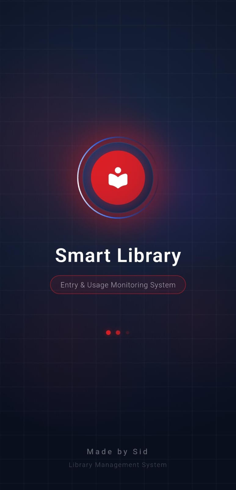
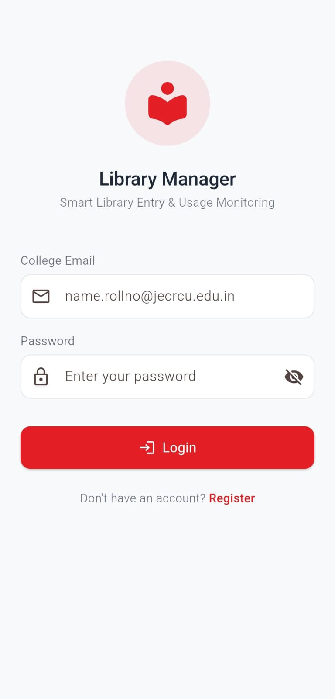
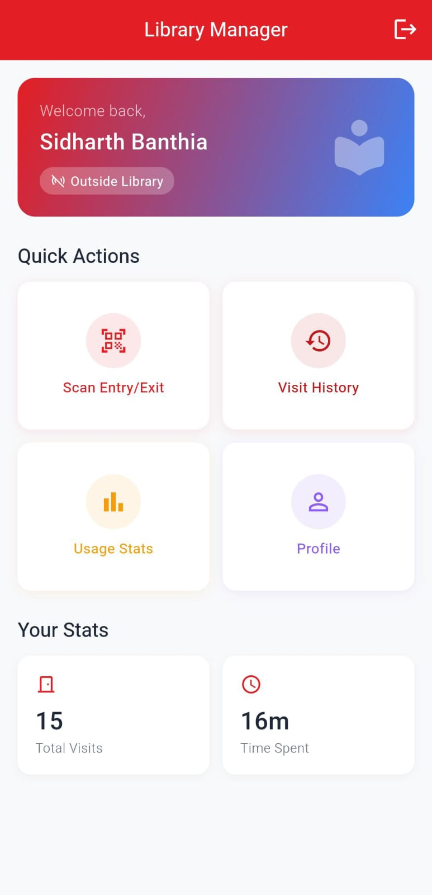
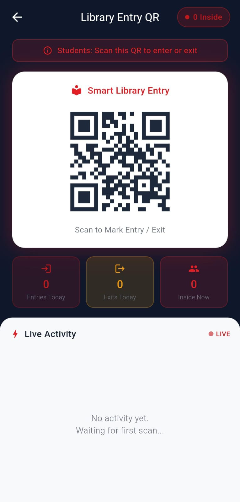
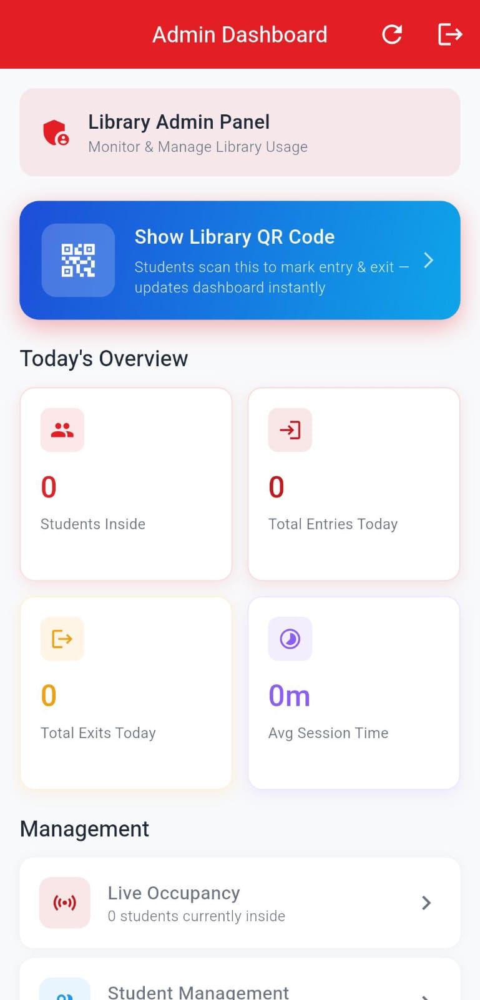
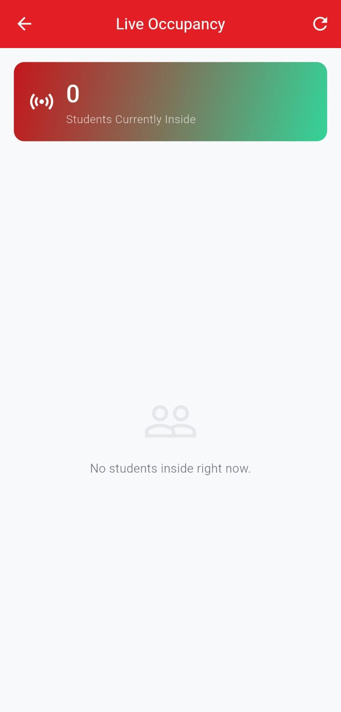

<div align="center">


<br /><br />

<h1>📚 Scan N' Study</h1>
<h3>Smart Library Entry & Usage Monitoring System</h3>

<p>A full-stack Flutter application that modernises library access management using QR-based entry/exit scanning, real-time occupancy tracking, and deep usage analytics — built for JECRC University.</p>

<br />

[](https://flutter.dev)
[](https://firebase.google.com)
[](LICENSE)
[](CONTRIBUTING.md)

</div>

---

## 📋 Table of Contents

- [Overview](#-overview)
- [Features](#-features)
- [Screenshots](#-screenshots)
- [Architecture](#-architecture)
- [Project Structure](#-project-structure)
- [Tech Stack](#-tech-stack)
- [Getting Started](#-getting-started)
- [Firebase Setup](#-firebase-setup)
- [How It Works](#-how-it-works)
- [Data Models](#-data-models)
- [Contributing](#-contributing)
- [License](#-license)

---

## 🔍 Overview

**Scan N' Study** eliminates manual library registers by replacing them with a fast, reliable QR-based entry & exit system. Students scan a fixed QR code displayed at the library entrance — the app instantly logs their entry or exit in Firestore and reflects the change live on the admin dashboard.

> Built for JECRC University's library but architected to be deployed at any institution.

**The problem it solves:**
- ❌ No more paper registers or manual headcounts
- ❌ No more guessing how many students are inside
- ❌ No more lost visit history or usage data
- ✅ Instant QR scan → Firestore write → live dashboard update in one seamless flow

---

## ✨ Features

### 👨‍🎓 Student Side
| Feature | Description |
|---|---|
| **QR Scan Entry/Exit** | Scan the library's fixed QR code to toggle between entry and exit |
| **Live Status Badge** | Instantly see if you're currently "Inside" or "Outside" on the home screen |
| **Visit History** | Full chronological log of all your library visits with timestamps |
| **Usage Statistics** | Total visits, total time spent, and average session duration |
| **Auto Login** | Session is persisted via SharedPreferences — no re-login on reopen |
| **Self Registration** | Students can create their own account with College ID, department & year |

### 🛡️ Admin Side
| Feature | Description |
|---|---|
| **Live Dashboard** | Real-time stats: students inside now, total entries/exits today, avg session |
| **Live Occupancy Screen** | See exactly who is inside the library right now with elapsed time |
| **QR Generator** | Generate, preview, save to gallery, or print the library entry QR code as PDF |
| **Student Management** | Add, edit, delete, block/unblock students with a searchable list |
| **Full Visit Logs** | Browse all entry/exit logs across all students, sorted by latest |
| **7-Day Analytics Chart** | Bar chart showing daily entry counts for the past week |
| **Reports Screen** | Daily/weekly usage summary for administrative reporting |
| **Auto-Refresh Timer** | The QR screen auto-refreshes the live count every second |

### ⚙️ System
| Feature | Description                                                                    |
|---|--------------------------------------------------------------------------------|
| **Real-Time Firestore Sync** | `DatabaseService` Firestore listener fires `notifyListeners()` on every change |
| **Offline-safe local cache** | All reads come from an in-memory cache populated at app start                  |
| **Role-based routing** | Admin and student see completely different navigation trees                    |
| **Email + College ID login** | Supports collegeId@jecrcu.edu.in` format                                 |
| **Animated Splash Screen** | Multi-stage animated logo with orb, shimmer, and slide-in effects              |

---

## 📸 Screenshots

> _Add screenshots of your app here. Recommended: Splash → Login → Student Home → Scan → Admin Dashboard → Live Occupancy_

| Splash | Login | Student Home |
|:---:|:---:|:---:|
|  |  |  |

| Scan Screen | Admin Dashboard | Live Occupancy |
|:---:|:---:|:---:|
|  |  |  |

---

## 🏗️ Architecture

```
┌──────────────────────────────────────────────────────────────┐
│                         Flutter UI                           │
│   Screens (features/)  ◄──►  Widgets (widgets/)             │
└─────────────────────────────┬────────────────────────────────┘
                              │ context.watch / context.read
┌─────────────────────────────▼────────────────────────────────┐
│                  State Management (Provider)                  │
│     AuthProvider   │   VisitProvider   │   UserProvider      │
└──────┬─────────────┴────────┬──────────┴──────────────────────┘
       │                      │ notifyListeners()
┌──────▼──────────────────────▼────────────────────────────────┐
│                      Service Layer                            │
│  AuthService  │  ScanService  │  DatabaseService  │Analytics  │
└──────────────────────────────┬───────────────────────────────┘
                               │ read/write + real-time listener
┌──────────────────────────────▼───────────────────────────────┐
│                     Firebase / Firestore                      │
│         Collection: students   │   Collection: visitLogs     │
└──────────────────────────────────────────────────────────────┘
```

The app follows a clean **Feature-First** folder structure with a strict separation of concerns:

- **UI Layer** — Screens consume providers via `context.watch`
- **Provider Layer** — Bridges UI and services, holds loading/error state
- **Service Layer** — All business logic, no Flutter imports (pure Dart)
- **Data Layer** — Firestore + local in-memory cache for synchronous reads

---

## 📂 Project Structure

```
lib/
├── main.dart                        # App entry, Firebase + DB init
│
├── core/
│   ├── constants/
│   │   ├── app_constants.dart       # Padding, radius, animation durations
│   │   └── app_strings.dart         # All UI copy in one place
│   ├── theme/
│   │   └── app_theme.dart           # AppColors + ThemeData
│   └── utils/
│       ├── date_utils.dart          # Duration & time formatters
│       └── validators.dart          # Form field validators
│
├── features/
│   ├── splash/
│   │   └── splash_screen.dart       # Animated logo + auto-login
│   ├── auth/
│   │   ├── login_screen.dart        # Student & admin login
│   │   └── register_screen.dart     # Self-registration for students
│   ├── student/
│   │   ├── student_home_screen.dart # Status card, quick actions
│   │   ├── scan_screen.dart         # Camera + QR detection + result overlay
│   │   ├── profile_screen.dart      # Student profile info
│   │   ├── visit_history_screen.dart
│   │   └── usage_stats_screen.dart
│   └── admin/
│       ├── admin_dashboard.dart     # Stats + nav cards
│       ├── live_occupancy_screen.dart # Real-time who's inside
│       ├── student_management_screen.dart
│       ├── qr_generator_screen.dart # QR display + save/print
│       ├── logs_screen.dart
│       └── reports_screen.dart
│
├── models/
│   ├── student_model.dart           # Student entity + Firestore serialisation
│   ├── visit_log_model.dart         # VisitLog + isActive + duration helpers
│   └── user_model.dart              # Logged-in user + role enum
│
├── providers/
│   ├── auth_provider.dart           # Login/logout state
│   ├── visit_provider.dart          # Scan processing + live update hook
│   └── user_provider.dart           # Current user data
│
├── services/
│   ├── auth_service.dart            # Login logic + SharedPreferences session
│   ├── database_service.dart        # Firestore CRUD + real-time listener
│   ├── scan_service.dart            # QR validation + entry/exit toggling
│   └── analytics_service.dart      # Aggregation queries on visit logs
│
├── routes/
│   └── app_routes.dart              # Named route registry (14 routes)
│
└── widgets/
    ├── cards/
    │   ├── student_card.dart
    │   └── visit_card.dart
    ├── charts/
    │   └── usage_chart.dart         # 7-day bar chart
    └── common/
        ├── custom_button.dart
        ├── custom_textfield.dart
        ├── loading_widget.dart
        └── stat_card.dart
```

---

## 🛠️ Tech Stack

| Layer | Technology |
|---|---|
| **Framework** | Flutter 3.x (Dart) |
| **State Management** | Provider (`ChangeNotifier`) |
| **Backend / Database** | Firebase Firestore |
| **Authentication** | Custom credential check + SharedPreferences session |
| **QR Scanning** | `mobile_scanner` |
| **QR Generation** | `qr_flutter` |
| **PDF Export** | `pdf` + `printing` |
| **Screenshot / Save** | `screenshot` + `gal` |
| **Local Session** | `shared_preferences` |
| **Routing** | Flutter named routes |

---

## 🚀 Getting Started

### Prerequisites

- Flutter SDK `>=3.0.0`
- Dart SDK `>=3.0.0`
- A Firebase project with Firestore enabled
- Android Studio / VS Code with Flutter extension

### Installation

1. **Clone the repository**

```bash
git clone https://github.com/your-username/scan-n-study.git
cd scan-n-study
```

2. **Install dependencies**

```bash
flutter pub get
```

3. **Configure Firebase** (see [Firebase Setup](#-firebase-setup) below)

4. **Run the app**

```bash
flutter run
```

### Default Admin Credentials

```
ID:       ADMIN001
Password: admin123
```

> ⚠️ Change these in `lib/core/constants/app_constants.dart` before deploying.

---

## 🔥 Firebase Setup

1. Go to [Firebase Console](https://console.firebase.google.com) and create a new project.

2. Add an **Android** and/or **iOS** app to your project.

3. Download `google-services.json` (Android) or `GoogleService-Info.plist` (iOS) and place them in the correct directories:
    - Android: `android/app/google-services.json`
    - iOS: `ios/Runner/GoogleService-Info.plist`

4. Run the FlutterFire CLI to generate `firebase_options.dart`:

```bash
dart pub global activate flutterfire_cli
flutterfire configure
```

5. In the Firebase Console, create a **Firestore Database** and set up these two collections:

```
students/
  {studentId}/
    id: string
    name: string
    collegeId: string
    password: string
    department: string
    year: string
    isBlocked: bool

visitLogs/
  {visitId}/
    id: string
    studentId: string
    studentName: string
    studentCollegeId: string
    entryTime: ISO8601 string
    exitTime: ISO8601 string | null
```

6. Set Firestore rules (development):

```js
rules_version = '2';
service cloud.firestore {
  match /databases/{database}/documents {
    match /{document=**} {
      allow read, write: if true; // 🔒 tighten for production
    }
  }
}
```

---

## ⚙️ How It Works

### QR Scan Flow

```
Student opens Scan Screen
        │
        ▼
Camera detects QR → rawValue extracted
        │
        ▼
VisitProvider.processScan(qrValue, studentId)
        │
        ▼
ScanService validates QR == "LIBRARY_SMART_ENTRY_2024"
        │
        ├── Has active visit? → record exitTime → ScanResult.exit
        │
        └── No active visit? → create new VisitLog → ScanResult.entry
                │
                ▼
        Firestore write
                │
                ▼
  _listenToLogs fires → cache updated
                │
                ▼
  onLogsChanged() → notifyListeners()
                │
                ▼
  Dashboard / LiveOccupancy rebuilds ✅
```

---

## 🤝 Contributing

Contributions are welcome! Here's how to get started:

1. Fork the repository
2. Create your feature branch: `git checkout -b feature/amazing-feature`
3. Commit your changes: `git commit -m 'Add amazing feature'`
4. Push to the branch: `git push origin feature/amazing-feature`
5. Open a Pull Request

### Ideas for Contribution
- 🔔 Push notifications when a student is inside too long
- 📊 Export visit logs as CSV/Excel
- 🌙 Dark mode support
- 🔒 Firebase Authentication instead of custom credential check
- 📱 Web admin panel via Flutter Web
- 🗓️ Seat reservation system

---

## 📄 License

This project is licensed under the MIT License — see the [LICENSE](LICENSE) file for details.

---

<div align="center">

Made by Sidharth Banthia
⭐ Star this repo if you found it useful!

</div>